# OffensiveAutoIt

Offensive tooling notes and experiments in [AutoIt v3](https://www.autoitscript.com/site/autoit/).

## Table of Contents

- [OffensiveAutoIt](#offensiveautoit)
  * [Why AutoIt?](#why-autoit)
  * [OffensiveAutoIt scripts](#offensiveautoit-scripts)
  * [Using AutoIt scripts](#using-autoit-scripts)
    - [Compiling scripts into standalone executables](#1-compiling-scripts-into-standalone-executables)
    - [Using scripts without compilation into executables](#2-using-scripts-without-compilation-into-executables)
      * [AutoIt3.exe](#i-autoit3exe)
      * [AutoItX](#ii-autoitx)
  * [Setting up a dev environment](#setting-up-a-dev-environment)
    - [Debugging](#debugging)
  * [Decompiling AutoIt executables](#decompiling-autoit-executables)
    - [Decompiling .a3x files](#decompiling-a3x-files)
  * [Obfuscating scripts](#obfuscating-scripts)
  * [AutoIt in the wild](#autoit-in-the-wild)
  * [Detection](#detection)
    - [YARA rules](#yara-rules)
    - [Miscellaneous](#miscellaneous)
  * [Blog posts](#blog-posts)
  * [AutoIt project references](#autoit-project-references)

## Why AutoIt?

- [Plenty of examples](#autoit-in-the-wild) online showing AutoIt being utilized for malware development but no *general* resource I could find that security folk new to the language can use to explore its capabilities and nuances.
- Ability to directly call external DLL and Windows API functions.
- Scripts can be executed using AutoIt3.exe (digitally signed binary) or compiled into standalone executables.
- Simplifies UI automation and interaction; GUI creation, simulating keystrokes and mouse movements, manipulating windows and processes.
- Very active community and countless [user defined functions](https://www.autoitscript.com/wiki/User_Defined_Functions) (UDFs).
- I love [byt3bl33d3r's](https://twitter.com/byt3bl33d3r) [OffensiveNim](https://github.com/byt3bl33d3r/OffensiveNim) repo and wanted to have a go at developing/researching tradecraft in a language that I wasn't familiar with.

## OffensiveAutoIt scripts

The examples in this repo are purely PoCs; I've tested them, but not thoroughly. The scripts are intended to be compiled and used as standalone console application executables but it's [not the only way](#2-using-scripts-without-compilation-into-executables) they can be utilized.

### Execution ([TA0002](https://attack.mitre.org/tactics/TA0002/))
| Script | Description | ATT&CK Reference |
| :------ | :---------- | :-----------  |
| [**ExecutePowershell.au3**](https://github.com/V1V1/OffensiveAutoIt/tree/main/Execution/ExecutePowerShell) | Hosts the CLR, bypasses AMSI & executes PowerShell through an unmanaged runspace. More info available in [this post](https://thevivi.net/blog/pentesting/2021-11-24-autoitmating-your-dotnet-tradecraft/). | [T1059.001](https://attack.mitre.org/techniques/T1059/001/) |
| [**ExecuteAssembly.au3**](https://github.com/V1V1/OffensiveAutoIt/tree/main/Execution/ExecuteAssembly) | Hosts the CLR, patches AMSI & ETW and executes a .NET assembly from memory. **NOTE:** This script doesn't support assembly arguments at the moment (WIP). More info available in [this post](https://thevivi.net/blog/pentesting/2021-11-24-autoitmating-your-dotnet-tradecraft/). | [T1027.002](https://attack.mitre.org/techniques/T1027/002/)<br>[T1218](https://attack.mitre.org/techniques/T1218/) |
| [**MSScriptControl.au3**](https://github.com/V1V1/OffensiveAutoIt/blob/main/Execution/MSScriptControl.au3) | Executes JScript and VBScript using the `MSScriptControl` COM object. Direct port of [scriptcontrol_bin.nim](https://github.com/byt3bl33d3r/OffensiveNim/blob/master/src/scriptcontrol_bin.nim) by [byt3bl33d3r](https://twitter.com/byt3bl33d3r). | [T1059.007](https://attack.mitre.org/techniques/T1059/007/)<br>[T1059.005](https://attack.mitre.org/techniques/T1059/005/) |
| [**ExcelCOM.au3**](https://github.com/V1V1/OffensiveAutoIt/blob/main/Execution/ExcelCOM.au3) | Executes shellcode using the Excel COM object and VBA macros. Direct port of [excel_com_bin.nim](https://github.com/byt3bl33d3r/OffensiveNim/blob/master/src/excel_com_bin.nim) by [byt3bl33d3r](https://twitter.com/byt3bl33d3r). | [T1059.005](https://attack.mitre.org/techniques/T1059/005/) |

### Persistence ([TA0003](https://attack.mitre.org/tactics/TA0003/))
| Script | Description | ATT&CK Reference |
| :------ | :---------- | :-----------  |
| [**NetUserAdd.au3**](https://github.com/V1V1/OffensiveAutoIt/blob/main/Persistence/NetUserAdd.au3) | Uses the `NetUserAdd` API to create a new computer/machine account. The user will be hidden in the control panel and from the net user/wmic commands. Adapted from [DoUCMe](https://github.com/Ben0xA/DoUCMe) by [Ben0xA](https://twitter.com/Ben0xA). | [T1136.001](https://attack.mitre.org/techniques/T1136/001/) |

### Defense Evasion ([TA0005](https://attack.mitre.org/tactics/TA0005/))
| Script | Description | ATT&CK Reference |
| :------ | :---------- | :-----------  |
| [**PatchAMSI.au3**](https://github.com/V1V1/OffensiveAutoIt/blob/main/Defense-Evasion/PatchAMSI.au3) | Bypasses AMSI by patching amsi.dll. | [T1562.001](https://attack.mitre.org/techniques/T1562/001/) |
| [**PatchETW.au3**](https://github.com/V1V1/OffensiveAutoIt/blob/main/Defense-Evasion/PatchETW.au3) | Patches ETW out of the current process. | [T1562.006](https://attack.mitre.org/techniques/T1562/006/) |

### Credential Access ([TA0006](https://attack.mitre.org/tactics/TA0006/))
| Script | Description | ATT&CK Reference |
| :------ | :---------- | :-----------  |
| [**MiniDump.au3**](https://github.com/V1V1/OffensiveAutoIt/blob/main/Credential-Access/MiniDump.au3) | Dumps process memory to a file on disk using the `MiniDumpWriteDump` API. | [T1003.001](https://attack.mitre.org/techniques/T1003/001/) |
| [**KeePassCredExport-1.au3**](https://github.com/V1V1/OffensiveAutoIt/blob/main/Credential-Access/KeePassCredExport-1.au3) | Exports credentials from an unlocked KeePass2 database to disk using UI automation & key presses. Reference blog post [here](https://thevivi.net/blog/pentesting/2021-11-23-pillaging-password-managers-with-ui-automation/). | [T1555.005](https://attack.mitre.org/techniques/T1555/005/) |
| [**KeePassCredExport-2.au3**](https://github.com/V1V1/OffensiveAutoIt/blob/main/Credential-Access/KeePassCredExport-2.au3) | Exports credentials from an unlocked KeePass2 database to disk using UI automation & key presses. Contains user idle time check. Reference blog post [here](https://thevivi.net/blog/pentesting/2021-11-23-pillaging-password-managers-with-ui-automation/). | [T1555.005](https://attack.mitre.org/techniques/T1555/005/) |
| [**BitwardenCredExport.au3**](https://github.com/V1V1/OffensiveAutoIt/blob/main/Credential-Access/BitwardenCredExport.au3) | Exports Bitwarden vault credentials to disk using UI automation & key presses. Requires Bitwarden's master password. Reference blog post [here](https://thevivi.net/blog/pentesting/2021-11-23-pillaging-password-managers-with-ui-automation/). | [T1555.005](https://attack.mitre.org/techniques/T1555/005/) |
| [**1PasswordCredExport.au3**](https://github.com/V1V1/OffensiveAutoIt/blob/main/Credential-Access/1PasswordCredExport.au3) | Exports 1Password vault credentials to disk using UI automation & key presses. Contains user input and visual block during extraction. Requires 1Password's master password and admin privileges on target PC. Reference blog post [here](https://thevivi.net/blog/pentesting/2021-11-23-pillaging-password-managers-with-ui-automation/). | [T1555.005](https://attack.mitre.org/techniques/T1555/005/) |

### Discovery ([TA0007](https://attack.mitre.org/tactics/TA0007/))
| Script | Description | ATT&CK Reference |
| :------ | :---------- | :-----------  |
| [**WMIEnum.au3**](https://github.com/V1V1/OffensiveAutoIt/blob/main/Discovery/WMIEnum.au3) | Enumerates basic info about a Windows host using WMI. | [T1047](https://attack.mitre.org/techniques/T1047/) |

### Lateral Movement ([TA0008](https://attack.mitre.org/tactics/TA0008/))
| Script | Description | ATT&CK Reference |
| :------ | :---------- | :-----------  |
| [**WMICommand.au3**](https://github.com/V1V1/OffensiveAutoIt/blob/main/Lateral-Movement/WMICommand.au3) | Executes a command on a remote computer using WMI. | [T1047](https://attack.mitre.org/techniques/T1047/) |

### Collection ([TA0009](https://attack.mitre.org/tactics/TA0009/))
| Script | Description | ATT&CK Reference |
| :------ | :---------- | :-----------  |
| [**Keylogger.au3**](https://github.com/V1V1/OffensiveAutoIt/blob/main/Collection/Keylogger.au3) | 	Logs a user's keystrokes using AutoIt's `IsPressed` function. | [T1056.001](https://attack.mitre.org/techniques/T1056/001/) |
| [**ScreenCapture.au3**](https://github.com/V1V1/OffensiveAutoIt/blob/main/Collection/ScreenCapture.au3) | Takes a screenshot and saves it in the user's temp directory. | [T1113](https://attack.mitre.org/techniques/T1113/) |
| [**ClipboardMonitor.au3**](https://github.com/V1V1/OffensiveAutoIt/blob/main/Collection/ClipboardMonitor.au3) | Periodically monitors the clipboard for text and prints the content to stdout. | [T1115](https://attack.mitre.org/techniques/T1115/) |

### Process Injection ([T1055](https://attack.mitre.org/techniques/T1055/))
| Script | Description | ATT&CK Reference |
| :------ | :---------- | :-----------  |
| [**DLLInjection.au3**](https://github.com/V1V1/OffensiveAutoIt/blob/main/Process-Injection/DLLInjection.au3) | Injects a DLL file on disk into a remote process. | [T1055.001](https://attack.mitre.org/techniques/T1055/001/) |
| [**CreateRemoteThread.au3**](https://github.com/V1V1/OffensiveAutoIt/blob/main/Process-Injection/CreateRemoteThread.au3) | Injects shellcode into a remote process using the `CreateRemoteThread` API. | [T1055.002](https://attack.mitre.org/techniques/T1055/002/) |
| [**QueueUserAPC.au3**](https://github.com/V1V1/OffensiveAutoIt/blob/main/Process-Injection/QueueUserAPC.au3) | Injects shellcode into a target executable using the `QueueUserAPC` API. | [T1055.004](https://attack.mitre.org/techniques/T1055/004/) |

## Using AutoIt scripts

First things first - install AutoIt from the [official site](https://www.autoitscript.com/site/autoit/downloads/).

AutoIt scripts can either be compiled into standalone executables (.exe) or AutoIt compiled scripts. Both plaintext script files (.au3) and compiled scripts (.a3x) must be executed using the `AutoIt3.exe` binary.

### 1. Compiling scripts into standalone executables

#### i) Aut2Exe

[Aut2Exe](https://www.autoitscript.com/autoit3/docs/intro/compiler.htm) is included in the default AutoIt installation and enables the compilation of scripts into standalone executables. It can be found in `C:\Program Files (x86)\AutoIt3\Aut2Exe`.

> **NOTE:** Aut2Exe doesn't perform any syntax checking, so AutoIt scripts compiled with it need to be completely free of any errors.	

There are 2 common ways to use Aut2Exe:<br>

**1. Command Line**

```
# General usage
Aut2Exe.exe /in in-script.au3 /out out-executable.exe [/other-options]

# Example: Compile script into a 32 bit executable console application
Aut2exe.exe /in "C:\Users\v1v1\OffensiveAutoIt\DLLInjection.au3" /out ".\DLLInjection.exe" /x86 /console

# Example: Compile script into a 64 bit executable console application with no UPX packing
Aut2exe.exe /in "C:\Users\v1v1\OffensiveAutoIt\DLLInjection.au3" /out ".\DLLInjection64.exe" /x64 /console /nopack
```
> **NOTE:** Aut2Exe will use UPX compression by default. Some security products really don't like executables packed with UPX, so you should probably avoid it.	

**2. GUI**

The Aut2Exe graphical interface can be launched from the Start Menu or by running Aut2Exe from the command line without any arguments.

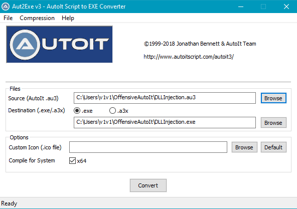

#### ii) SciTE4AutoIt

The [SciTE4AutoIt text editor](https://www.autoitscript.com/site/autoit-script-editor/) comes installed with AutoIt. SciTE4AutoIt, unlike Aut2Exe, can perform syntax/error checking of scripts before compilation.<br>
To compile a script using SciTE4AutoIt, just open it in the editor and hit `Ctrl+F7` to bring up the compilation menu or just `F7` to build immediately.

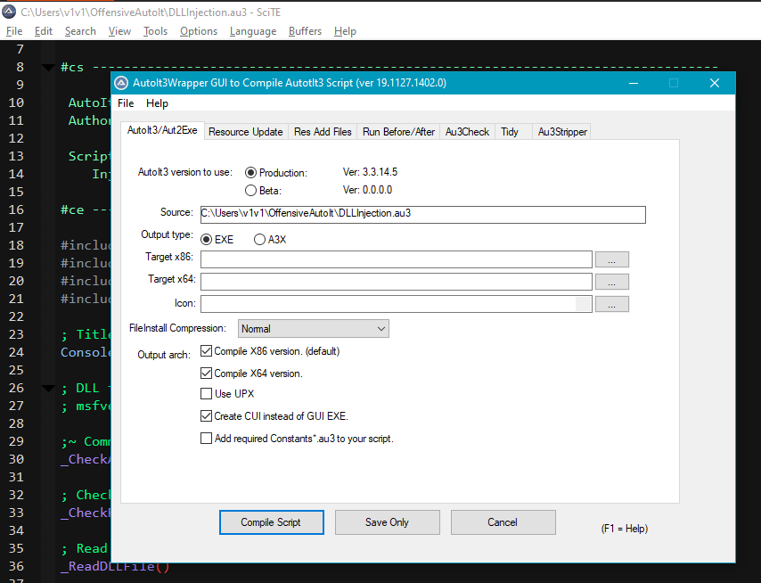

### 2. Using scripts without compilation into executables

#### i) AutoIt3.exe

[AutoIt3.exe](https://documentation.help/AutoIt/Running.htm) is the main  program used to run AutoIt scripts without having to compile them into executables. Both `AutoIt3.exe` and `AutoIt3_x64.exe` (64 bit version) can be found in `C:\Program Files (x86)\AutoIt3`. 

There are 2 primary benefits to using AutoIt3.exe:

1. It's the only program required to run an AutoIt script - even on systems without AutoIt installed. All you need is AutoIt3.exe (or AutoIt3_x64.exe) and the script(s) you want to execute and you can run them on any Windows system you want to.
2. It's digitally signed; which is a bit of a bonus for opsec since you're going to have to drop it on disk to use it on target systems.

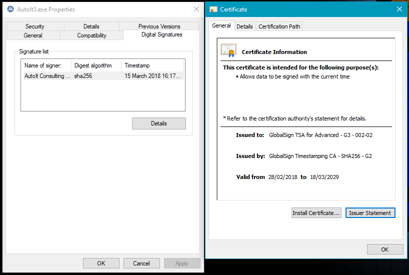

**AutoIt3.exe usage**

```
# General usage
AutoIt3.exe script.au3 [optional parameters]

# Example: Execute a regular script without command line parameters
.\AutoIt3.exe .\KeePassCredExport-1.au3

# Example: Execute an .a3x compiled script with command line parameters 
.\AutoIt3.exe .\CreateRemoteThread.a3x 1234
```

AutoIt scripts without any [includes](https://www.autoitscript.com/autoit3/docs/keywords/include.htm) in them can simply be executed by passing the plaintext script as an argument to AutoIt3.exe.

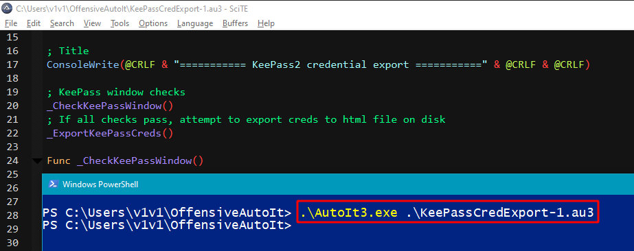

Unfortunately, you can't use `AutoIt3.exe` to execute an AutoIt script with includes in it since the included files won't exist on systems without AutoIt installed. If you try to do it, you'll get an error similar to this:

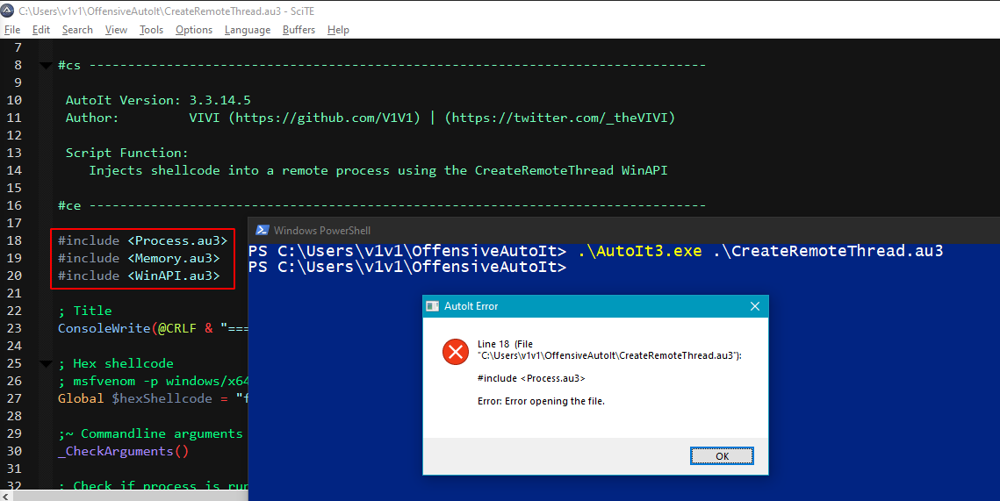

> **NOTE:** I was wrong about this. You can actually use the [Au3Stripper](https://www.autoitscript.com/autoit3/scite/docs/SciTE4AutoIt3/Au3Stripper.html) utility included in SciTE4AutoIt to combine both your script and any referenced include files into a single source file. You can access Au3Stripper by bringing up SciTE4AutoIt's compile menu (`Ctrl+F7`). The combined source file (scriptName_stripped.au3) will be placed in the same directory as your original script. Hat tip to [rcmaehl](https://github.com/rcmaehl) for the correction.

The problem is includes are pretty important since they add a lot of useful functionality to AutoIt scripts e.g. [Windows API functions](https://www.autoitscript.com/autoit3/docs/libfunctions/WinAPI%20Management.htm). But there's a way around this.<br>
Compile the script with the `.a3x` extension; this format builds a single file that contains the script itself and all referred #include files.

```
# Compiling a script into .a3x format using Aut2Exe
Aut2Exe.exe /in in-script.au3 /out out-script.a3x
```

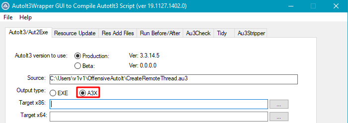

Now we can use the .a3x compiled script with AutoIt3.exe just like we would with a "normal" AutoIt script.<br>
Example: Using `AutoIt3_x64.exe` and the .a3x version of [CreateRemoteThread.au3](./Process-Injection/CreateRemoteThread.au3) to inject MessageBox shellcode into a 64 bit process (notepad.exe). 

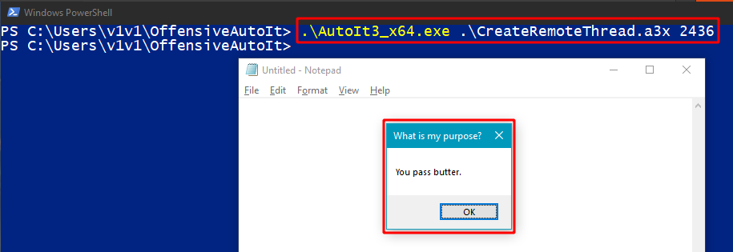

**Stuff to note about .a3x files:**

1. An [.a3x file](https://www.autoitscript.com/forum/topic/158286-how-this-a3x-works/?do=findComment&comment=1148181) is simply an AutoIt binary compiled with all its referenced `#include` files and without the AutoIt interpreter built into it.
2. They're much smaller than scripts compiled into standalone executables.
```bash
❯ ls -lh MiniDump.*
-rw------- 1 vivi vivi 244K May  7 01:55 MiniDump.a3x
-rw------- 1 vivi vivi 1.1M May  7 01:55 MiniDump.exe
```
3. I've only done very minimal testing, but it seems like compiling scripts into .a3x format instead of .exe helps reduce detection by some AV software, so it's probably the best format to use even with scripts without includes in them.
4. This is a bit of a bummer, but when using AutoIt3.exe to execute an .a3x or .au3 file, [you don't get any console output](https://stackoverflow.com/a/54252275). The script will work just fine with any number of arguments but won't print anything to stdout. If you really need the output from your script e.g. when using a [keylogger](https://github.com/V1V1/OffensiveAutoIt/blob/main/Collection/Keylogger.au3) - consider piping the script's execution to `more` or `Out-Host` or just modifying it to redirect output to a file instead of writing to console.

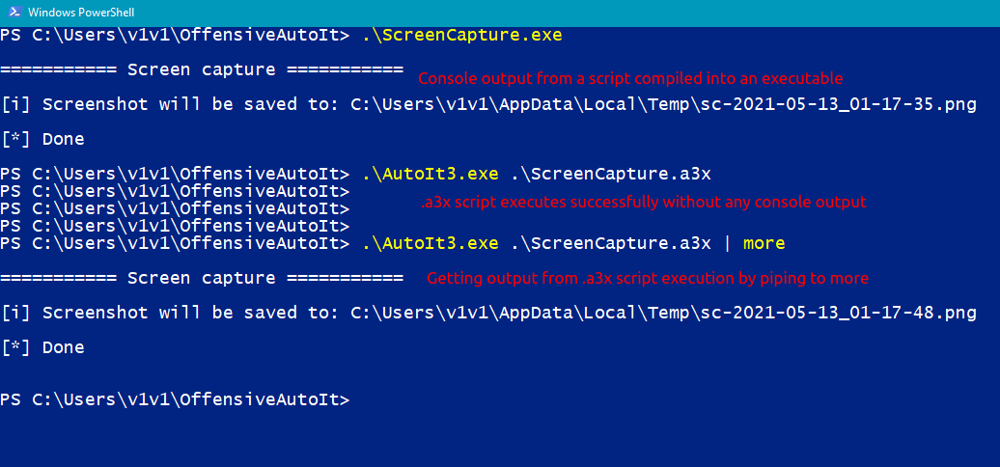

> **NOTE:** It's possible to [modify the AutoIt3.exe executable](https://www.autoitscript.com/forum/topic/17380-using-autoit-to-make-console-applikations/) to change the console output behavior, but that would break the binary's digital signature and we really don't want to do that.

#### ii) AutoItX

AutoIt installations come packaged with [AutoItX](https://documentation.help/AutoItX/introduction.htm); a DLL version of AutoIt v3 that enables you to use AutoIt-like features from other languages (Powershell, C#, C++, VB etc.).

The AutoItX files can be found in `C:\Program Files (x86)\AutoIt3\AutoItX`. The 4 primary DLLs are:

* **AutoItX3.Assembly.dll** - The .NET assembly for using AutoItX.
* **AutoItX3.PowerShell.dll** - The PowerShell module code.
* **AutoItX3.dll** - The main AutoItX DLL (x86).
* **AutoItX3_x64.dll** - The main AutoItX DLL (x64).

C# devs can also incorporate AutoIt's features in their .NET projects by utilizing the AutoIt [Nuget package](https://www.nuget.org/packages/AutoItX.Dotnet/). Adding it to a project will automatically include all the DLL files required for use with C# executables.

I personally don't see the value in using AutoIt as a replacement for C# in any scenario unless it involves UI automation, which is still possible using C# but requires a little more effort to implement.

The sample C# code below demonstrates how simple it is to use AutoIt in a .NET project to open a program (calc.exe) and send keystrokes to it.

```c#
using AutoIt;
using System;

namespace AutoItX_demo
{
    class Program
    {
        static void Main(string[] args)
        {
            // Open calc
            AutoItX.Run("calc.exe", ".", 1);
            AutoItX.WinWaitActive("Calculator");
            // Wait for window to appear and do some math
            AutoItX.Sleep(2000);
            AutoItX.Send("420*69");
            AutoItX.Send("{ENTER}");
            // Close the calc window
            AutoItX.Sleep(2000);
            IntPtr winHandle = AutoItX.WinGetHandle("Calculator");
            AutoItX.WinKill(winHandle);
        }
    }
}

```
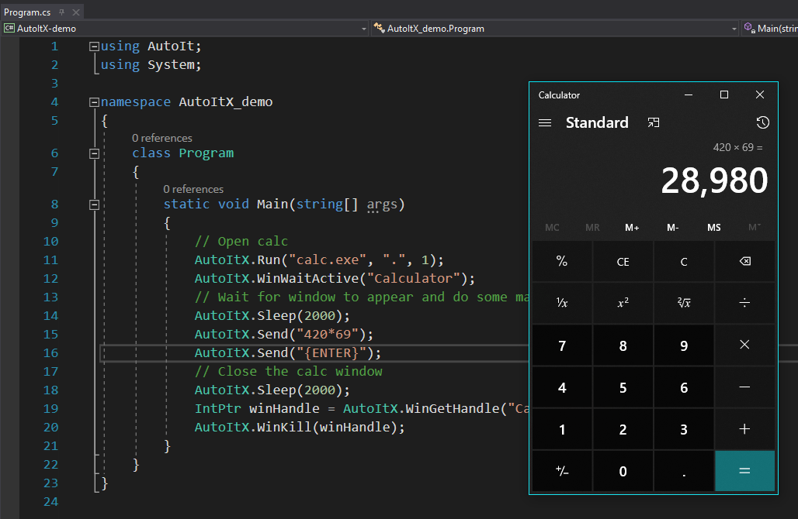

**Invoke-AutoIt**

[Invoke-AutoIt](https://github.com/byt3bl33d3r/Invoke-AutoIt) is a Powershell script written by [byt3bl33d3r](https://twitter.com/byt3bl33d3r) that loads the AutoIt DLLs and PowerShell assemblies into memory and executes user specified keystrokes in target windows.

## Setting up a dev environment

**SciTE4AutoIt**

Getting started with AutoIt development is pretty straightforward. The default AutoIt installation comes with a lite version of the SciTE4AutoIt text editor.
I'd recommend downloading and installing the [full version of SciTE4AutoIt](https://www.autoitscript.com/site/autoit-script-editor/downloads/) to get access to the editor's entire suite of features.

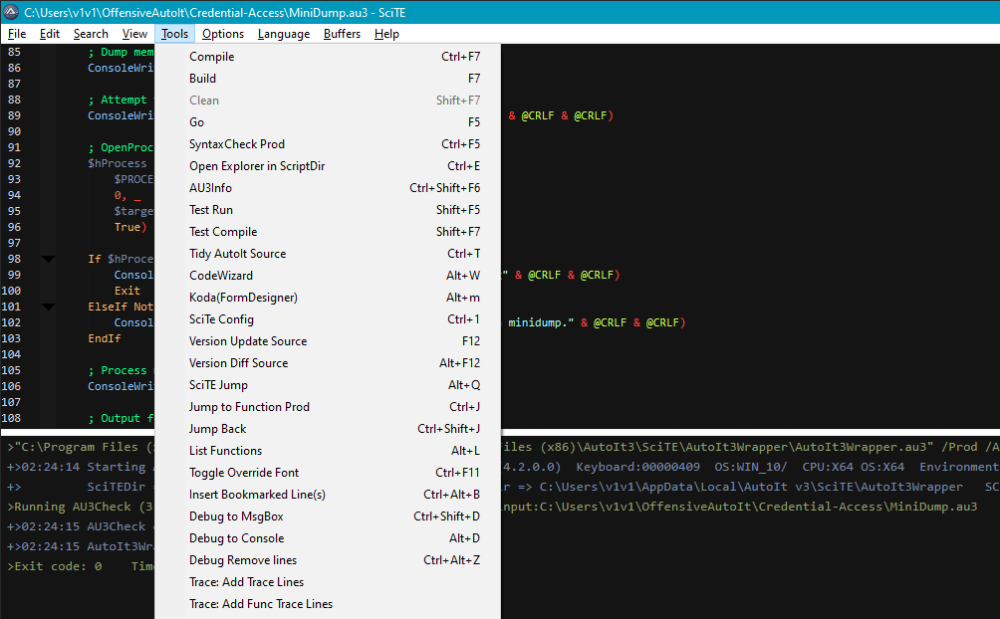

**VS Code**

VS Code has an [AutoIt extension](https://marketplace.visualstudio.com/items?itemName=Damien.autoit) which is painless to install and configure.
Once installed from the marketplace, you can open the extension's settings by opening VS Code's command palette (`Ctrl+Shift+P`) and searching for "user settings" and selecting `AutoIt Configuration` under the `Extensions` menu. The [extension's configuration](https://marketplace.visualstudio.com/items?itemName=Damien.autoit#configuration) should already be set up for a default installation of AutoIt and SciTE4AutoIt on a 64 bit Windows system but can also be modified for custom setups.

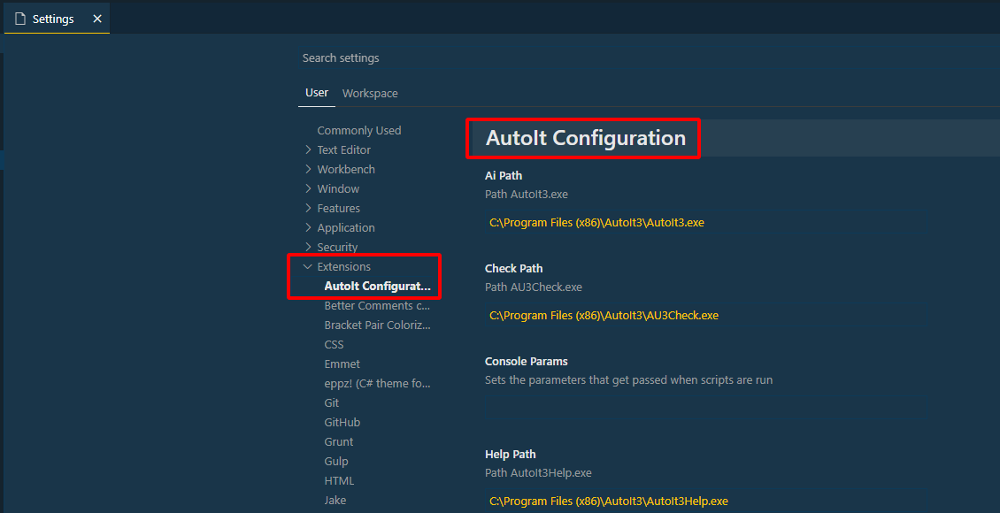

Now you can edit, debug and build your AutoIt scripts right from VS Code.

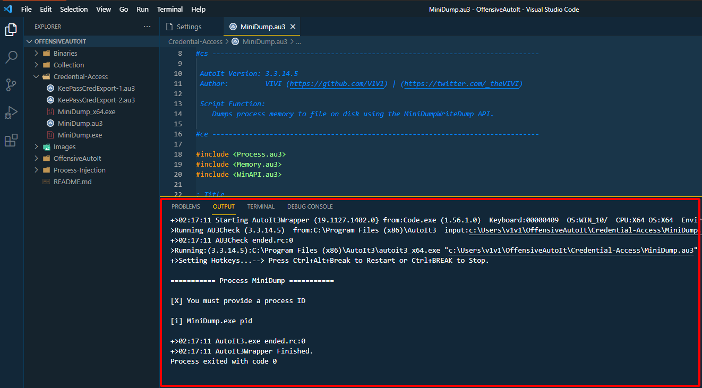

#### **Debugging**

A few options for debugging scripts are outlined in [this post](https://www.autoitscript.com/wiki/FAQ#How_can_I_debug_my_script.3F) on the official wiki. 

## Decompiling AutoIt executables

Standalone AutoIt executables can usually be easily identified by using analysis tools like [PeStudio](https://www.winitor.com/).

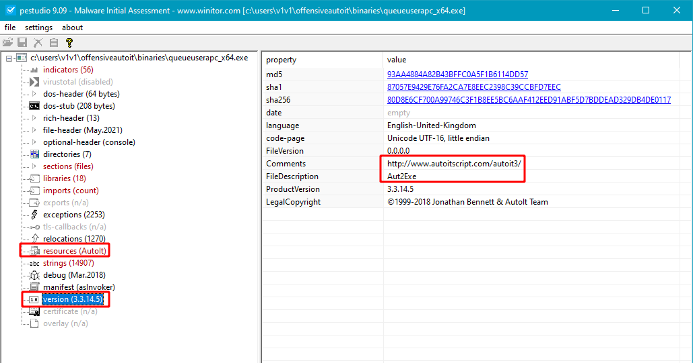

Older versions of AutoIt used to ship with an official decompiler, but that's [no longer the case](https://www.autoitscript.com/wiki/Decompiling_FAQ). <br>
3rd party decompilers exist, but **use them at your own risk**. Some of these programs will execute the script's code during the decompilation process, potentially executing any malicious code in them on your system. So always use a sandbox environment when attempting to decompile AutoIt executables. 

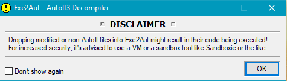

[Exe2Aut](https://exe2aut.com/exe2aut-converter/) seems to be the most popular and most referenced decompiler I could find. Using it is pretty simple, just open Exe2Aut and drag an AutoIt compiled executable into the decompiler's window.

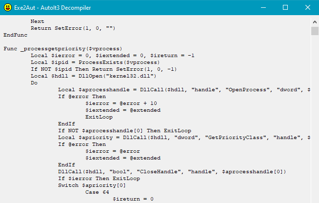

Exe2Aut doesn't have support for 64 bit AutoIt executable decompilation but some of the tools mentioned in the section below do.

#### **Decompiling .a3x files**

.a3x files can be identified using tools like [ExeInfo](https://exeinfo-pe.en.uptodown.com/windows/download) and [Detect It Easy(DiE)](https://github.com/horsicq/Detect-It-Easy)
 or by manually searching for occurrences of "AU3!" string in the file's contents.

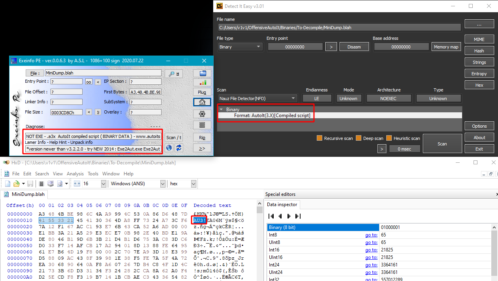

[myAut2Exe](https://github.com/fossabot/myAut2Exe) doesn't seem to be as widely referenced as Exe2Aut but it's definitely the more advanced decompiler. 2 significant advantages it has over Exe2Aut is the ability to decompile .a3x files and 64 bit AutoIt executables.

To decompile an .a3x file using myAut2Exe, just drag the file into the "**File or Folder**" textbox, click on the "**Scan File**" menu and select the "**Automated**" option. Give it a little time and you should end up with the decompiled source code. The decompiled script will be written to the same directory as the target .a3x/.exe file.


Another great alternative and my personal preference for AutoIt decompilation is [AutoIt Extractor](https://gitlab.com/x0r19x91/autoit-extractor) by [x0r19x91](https://twitter.com/x0r19x91).

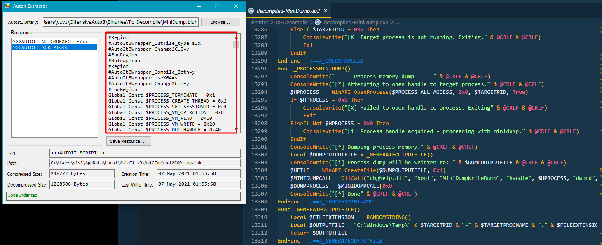

> **NOTE:** It's possible to defeat/mislead the decompilation process of both Exe2Aut and myAut2Exe. There's a post demonstrating techniques to do it for both decompilers [here](https://unit42.paloaltonetworks.com/autoit-compiled-malware/).

**Other decompilation tools**

Some more tools with decompilation capabilities worth mentioning are:
- [AutoIt-Ripper](https://github.com/nazywam/AutoIt-Ripper) by [Nazywam](https://twitter.com/nazywam).
- [UnAutoIt](https://github.com/x0r19x91/UnAutoIt) by [x0r19x91](https://twitter.com/x0r19x91).
- [ClamAV](https://www.clamav.net/).

**AutoIt-Ripper**

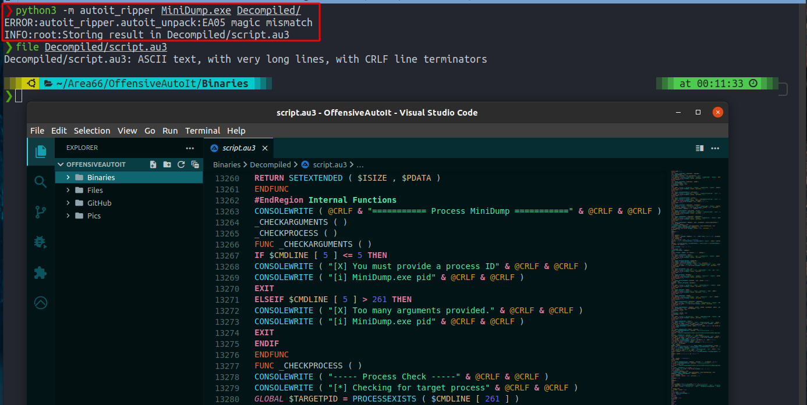

**UnAutoIt**

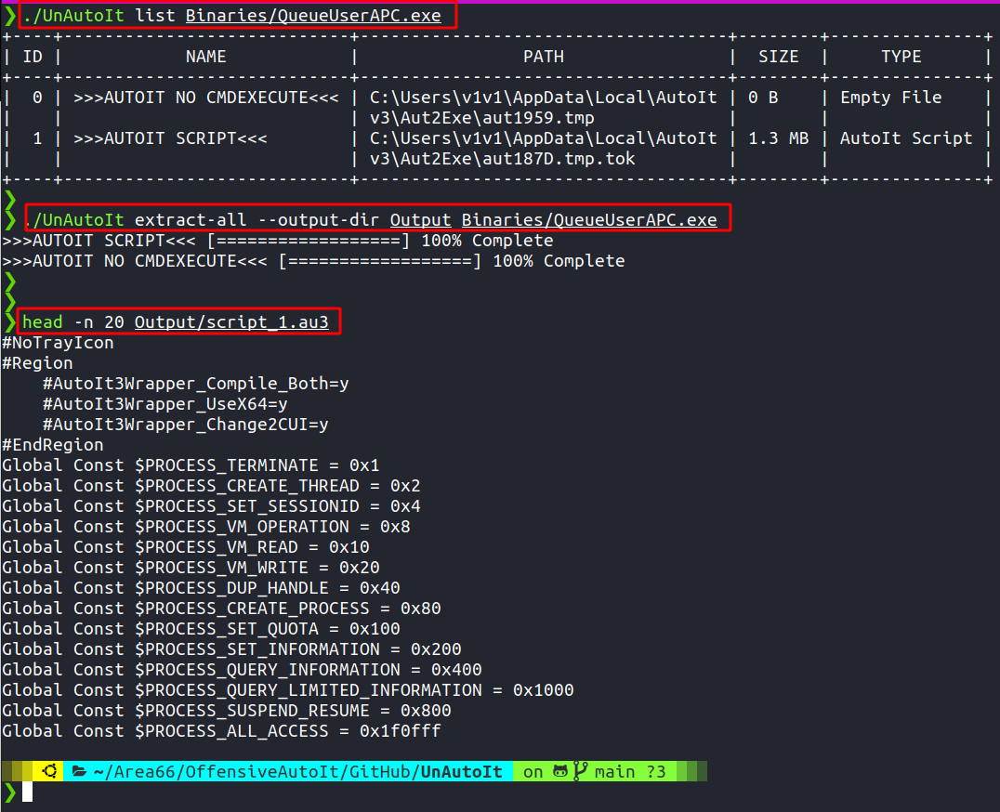

**ClamAV**

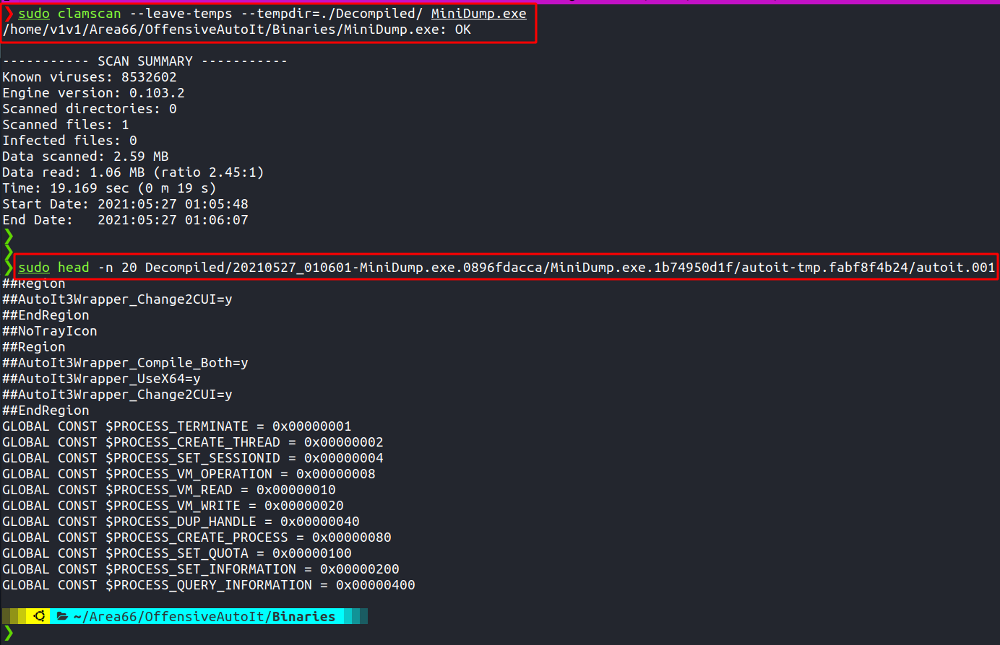

**References**
- https://vk-intel.org/tag/autoit/
- https://0xdf.gitlab.io/flare-on-2020/codeit
- https://web.archive.org/web/20190827061152/https://0xffff0800.blogspot.com/2019/01/defeating-au3-obfusticated-malware.html
- https://r3mrum.wordpress.com/2017/07/10/autoit-malware-from-compiled-binary-to-plain-text-script/
- https://www.hexacorn.com/blog/2015/01/08/decompiling-compiled-autoit-scripts-64-bit-take-two/
- Video - [Unpacking Malware that uses AutoIt by Josh Stroschein](https://www.youtube.com/watch?v=ww5tr0863BY)
- Video - [Analyzing Ransomware - Reversing AutoIT Ransomware by Michael Gillespie](https://www.youtube.com/watch?v=jVV-la01q-M)

## Obfuscating scripts

Because AutoIt executables are trivial to decompile in most cases, script obfuscation is something worth looking into if you're considering developing any offensive tools. 

A number of free and paid obfuscators are publicly available. The most featured one I could find is [PELock's AutoIt Obfuscator](https://www.pelock.com/products/autoit-obfuscator) which isn't free but does offer a limited trial version and [online obfuscator](https://www.pelock.com/autoit-obfuscator/).
As expected, obfuscating scripts makes analysis of extracted source code a little more challenging.

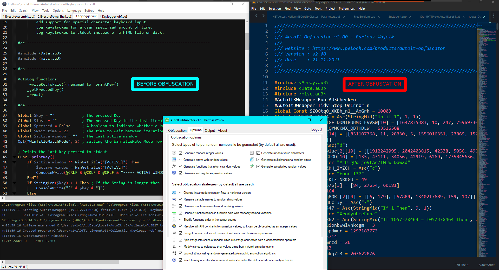

Funnily enough, obfuscating a script might actually raise its AV engine detection count.

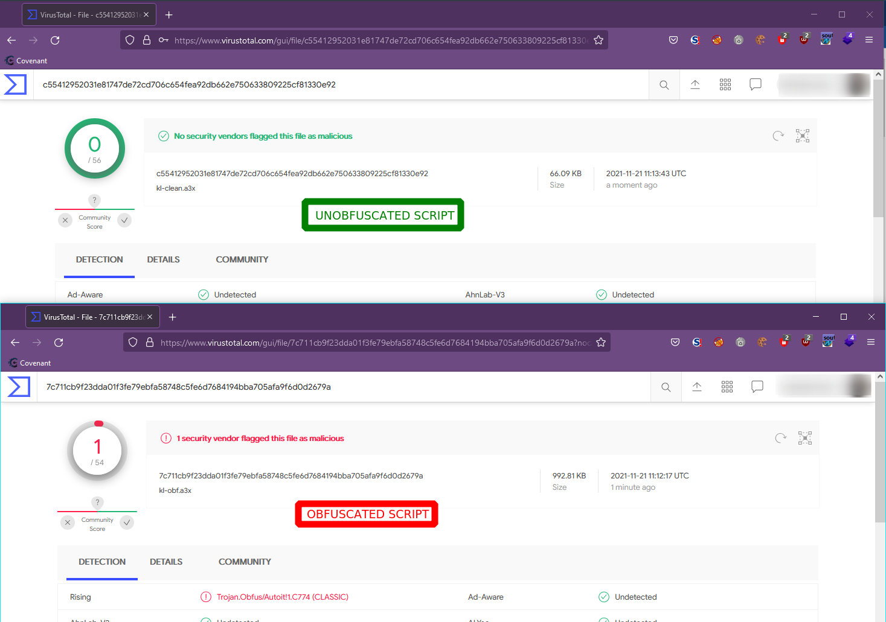

**Other obfuscators**

> **NOTE:** I haven't tested any of these. Use them at your own discretion.

- https://github.com/jogonba2/Autoit-Obfuscator
- https://www.autoitscript.com/forum/topic/196406-cryptodragon-obfuscator-v1401/
- https://github.com/simplymercurial/ObfuscatorSG

**Deobfuscating AutoIt**
- https://lifeinhex.com/deobfuscating-autoit-scripts/
- http://rinseandrepeatanalysis.blogspot.com/2019/09/deobfuscatingreversing-remcos-autoit.html

## AutoIt in the wild

AutoIt is far from unfamiliar to malware authors; from skids to advanced threat actors. Check out the links below for examples of AutoIt malware discovered in the wild.

- Zebrocy
  * https://vk-intel.org/2019/01/22/lets-learn-progression-of-apt28-autoit-zebrocy-downloaders-source-code-level-analysis/
  * https://www.welivesecurity.com/2018/04/24/sednit-update-analysis-zebrocy/

- Chafer
  * https://sec0occultism.wordpress.com/2019/06/01/analysis-of-iranian-based-threat-group-chafer-malware-autoit-and-powershell-persistence/
  * https://vk-intel.org/2018/03/25/lets-learn-internals-of-iranian-based-threat-group-chafer-malware-autoit-and-powershell-persistence/

- AutoIt backdoor
  * https://attack.mitre.org/software/S0129/
  * https://www.forcepoint.com/sites/default/files/resources/files/forcepoint-security-labs-monsoon-analysis-report.pdf

- Qulab
  * https://fumik0.com/2019/03/25/lets-play-with-qulab-an-exotic-malware-developed-in-autoit/

- CypherIT
  * https://research.checkpoint.com/2019/decypherit-all-eggs-in-one-basket/
  * https://malwareindepth.com/defeating-nanocore-and-cypherit/
  * https://raw-data.gitlab.io/post/autoit_fud/

- Frenchy shellcode
  * https://www.zscaler.com/blogs/security-research/frenchy-shellcode-wild
  * https://blog.morphisec.com/lokibot-with-autoit-obfuscated-frenchy-shellcode
  * http://www.peppermalware.com/2019/07/analysis-of-frenchy-shellcode.html

- Masad Stealer
  * https://blogs.juniper.net/en-us/threat-research/masad-stealer-exfiltrating-using-telegram
  * https://mirshadx.wordpress.com/2020/11/15/analyzing-a-heavily-obfuscated-autoit-malware-masad/

- Others
  * https://www.zscaler.com/blogs/security-research/taurus-new-stealer-town
  * https://www.zscaler.com/blogs/security-research/cybergate-rat-and-redline-stealer-delivered-ongoing-autoit-malware-campaigns
  * https://blog.morphisec.com/nanocore-under-the-microscope
  * https://www.trendmicro.com/en_us/research/21/b/finding-multi-step-obfuscated-malware.html
  * https://blog.talosintelligence.com/2017/05/modified-zyklon-and-plugins-from-india.html
  * https://blog.talosintelligence.com/2015/08/malware-meets-sysadmin-automation-tools.html
  * https://yoroi.company/research/the-ave_maria-malware/
  * https://lifars.com/wp-content/uploads/2020/07/Clipper-AutoIt-v2-QUILCLIPPER-AutoIt-Malware.pdf
  * https://www.trendmicro.com/en_us/research/18/k/autoit-compiled-worm-affecting-removable-media-delivers-fileless-version-of-bladabindi-njrat-backdoor.html
  * https://www.fortinet.com/blog/threat-research/predator-the-thief-new-routes-delivery
  * https://www.cyberbit.com/blog/endpoint-security/formbook-research-hints-large-data-theft-attack-brewing/

## Detection

Resources to help with detection.

#### **YARA rules**

- https://github.com/nazywam/AutoIt-Ripper/blob/master/autoit_rule.yar
- https://github.com/jipegit/yara-rules-public/blob/master/Packer/AutoIT.yar
- https://github.com/ail-project/ail-yara-rules/blob/master/rules/code/autoit.yar
- https://github.com/bartblaze/Yara-rules/blob/master/rules/generic/AutoIT.yar

#### **Miscellaneous**

- EQL rule - [Renamed AutoIt Scripts Interpreter](https://www.elastic.co/guide/en/security/current/renamed-autoit-scripts-interpreter.html)
- Video - [FSec2017: Hiding Malware Payloads With Autoit by Vanja Svajcer](https://www.youtube.com/watch?v=qrXUTAIhbgo)
- Video - [BSidesLV 2021: Analyzing AutoIt Malware: Tools and Techniques by Chris Neal](https://www.youtube.com/watch?v=iVtPznzM3fA&ab_channel=BSidesLV)

## Blog posts

Just some blog posts I've found (or written) about AutoIt tradecraft.
- https://thevivi.net/blog/pentesting/2021-11-22-operating-with-autoit/
- https://thevivi.net/blog/pentesting/2021-11-24-autoitmating-your-dotnet-tradecraft/
- https://blog.usejournal.com/red-team-diary-entry-3-custom-malware-development-establish-a-shell-through-the-browser-bed97c6398a5 

## AutoIt project references

Projects built in/for Autoit - not necessarily security related.
- https://www.autoitscript.com/forum/topic/188158-net-common-language-runtime-clr-framework/ (.NET in AutoIt)
- https://github.com/J2TEAM/awesome-AutoIt
- https://www.autoitscript.com/wiki/User_Defined_Functions

